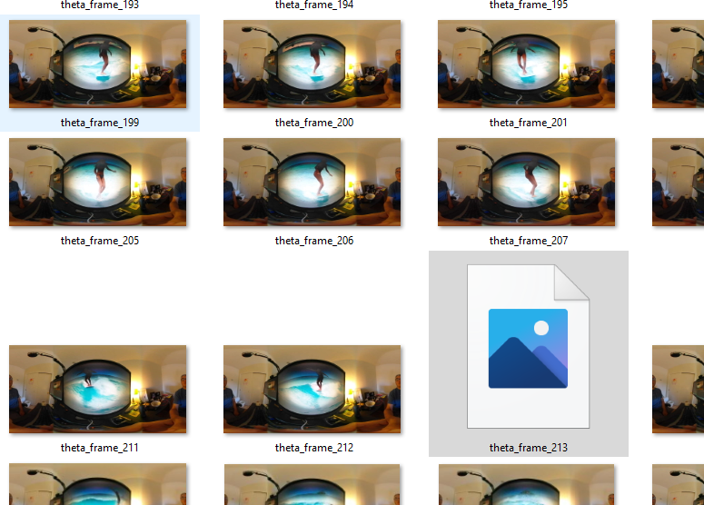

# SC2 Live Preview Problems

The Dart program I'm using can't read SC2 frames properly at 30fps.  It's like that some of the SC2 frames have broken images.

When displayed on the Flutter screen, some of the frames are not
displaying properly.  It seems like `gaplessPlayback` can't compensate
enough.  

With the Z1, the stream is smooth.

At 5fps, 1 out of the 300 frames I tested was not readable, which is
likely a usable ratio and likely something the software can compensate for.

[Link to 1 minute test video](https://youtu.be/3P-YKr1dzQU).